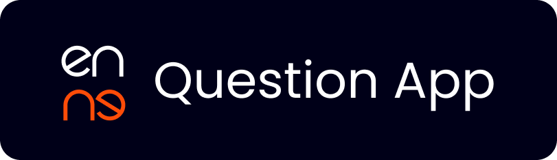
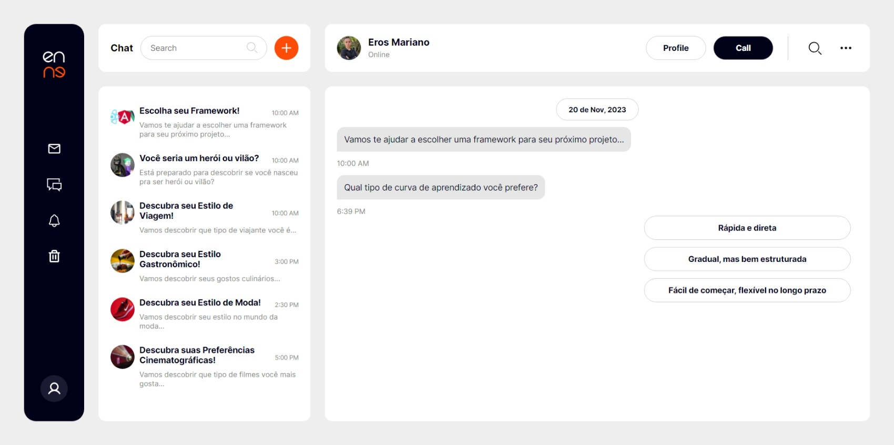

<h1 id="sobre" style="margin-top: 20px; margin-bottom: 20px; text-align: center;"><strong>EnneCode -Question App</strong></h1>

> Esse é um projeto desenvolvido com angular, com objetivo de criar uma aplicação de quizz, onde o usuário vai poder escolher um ou mais "chats" e descobrir o que lhe condiz com o perfil





## Como instalar

* Para baixar o projeto, siga as instruções abaixo:

```
1. git clone https://github.com/erosMariano/angular-question-app
2. cd angular-question-app
```
```
3. npm install
4. npm dev
```


## Entre em contato
[Eros Mariano - Linkedin](https://www.linkedin.com/in/erosmariano)


<a href="https://blog.rocketseat.com.br/author/thiago/">
 
 <br />
 <sub><b>Eros Mariano</b></sub></a> <a href="https://www.linkedin.com/in/erosmariano/" title="Rocketseat"></a>


Feito com ❤️ por Eros Mariano 👋🏽 Entre em contato!
